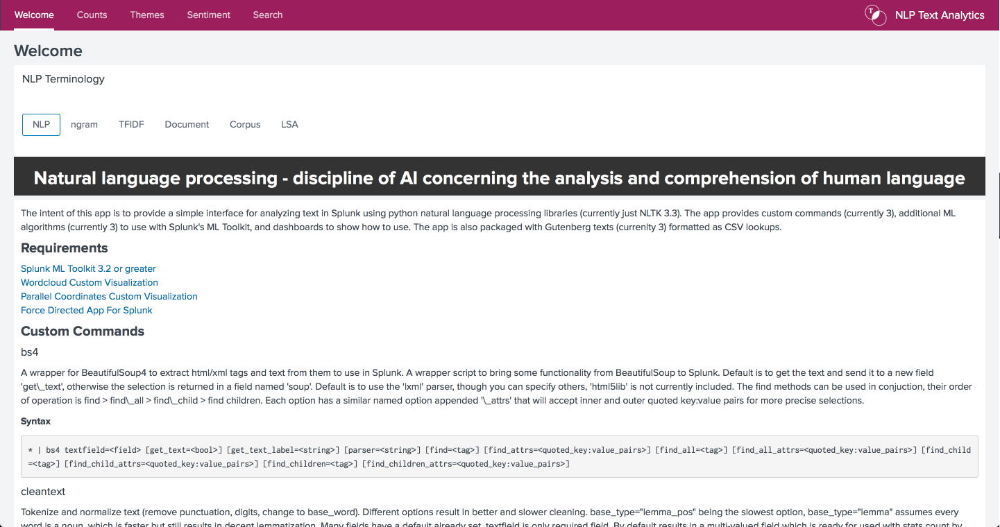
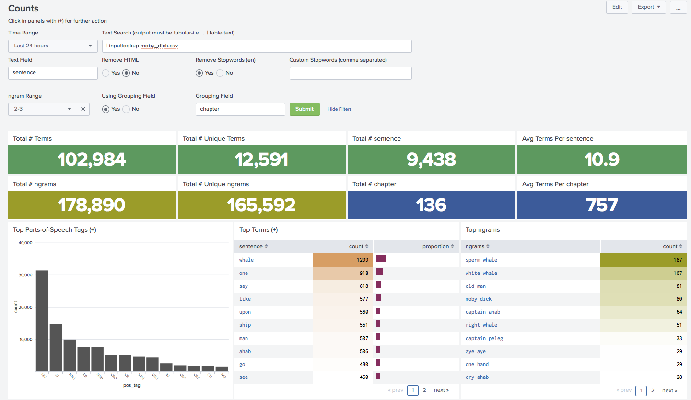
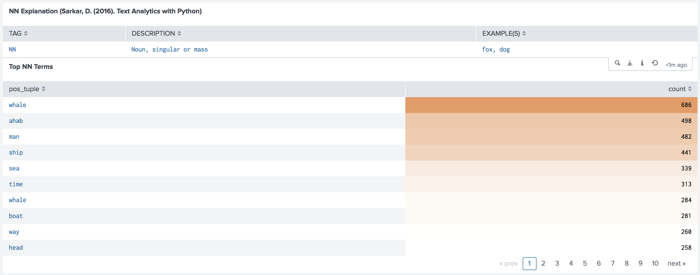
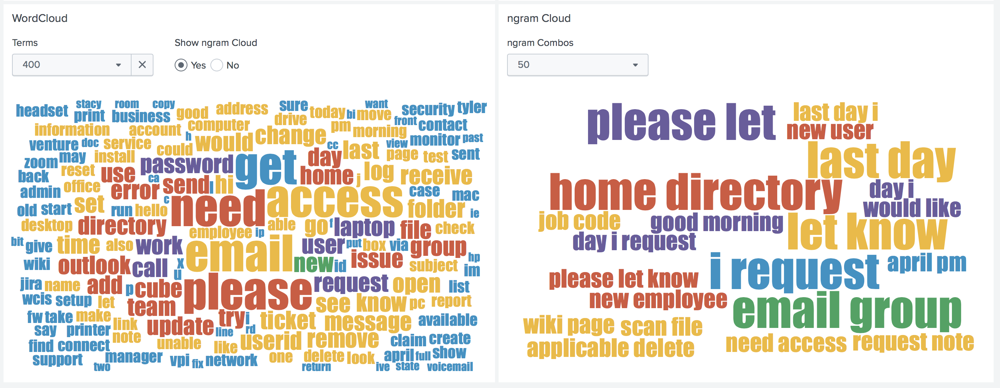
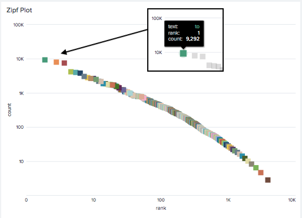
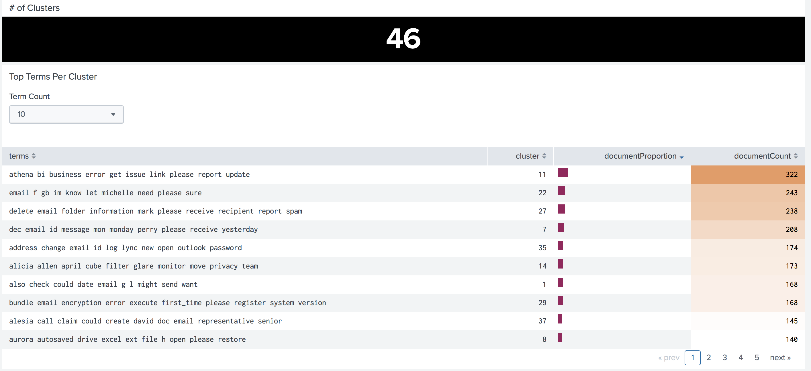
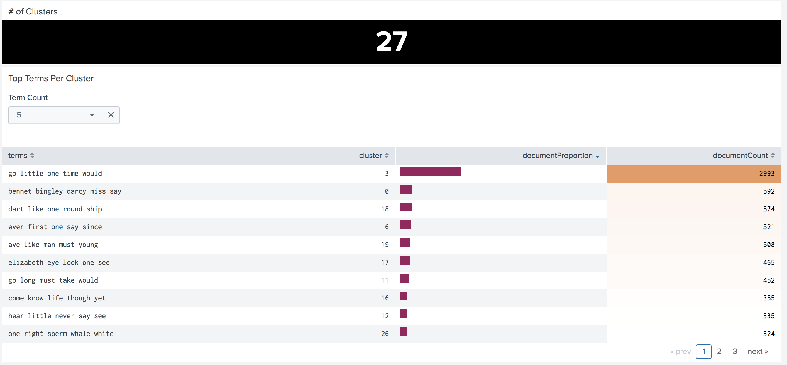
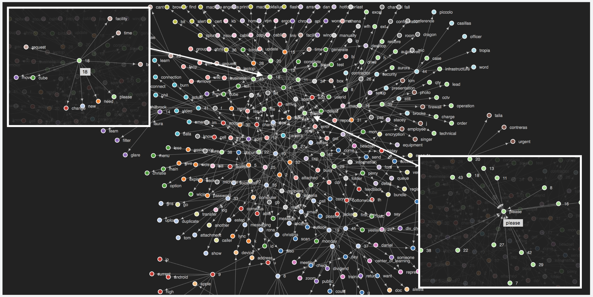
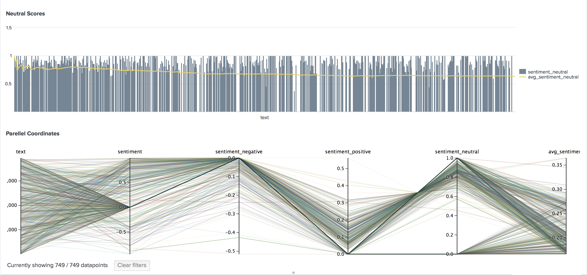

# NLP Text Analytics Splunk App - Blog
##### Author: Nathan Worsham
##### Created for MSDS692 Data Science Practicum I at Regis University, 2018

Most other projects for the Data Science Practicum revolved around collecting a dataset, cleaning it, exploring it, and then using machine learning algorithms on it to perform some sort of prediction, classification, or extrapolate some analysis. I decided to take a step a bit outside of the batter's box and instead build a Splunk App for my project. I would find out quickly however, that the app still ends up following these familiar steps in its own ways.

## Inspiration
Let me first preface by stating I am not a developer... but I don't let that stop me. Like many of my cohorts, I have always worked in information technology but I have a completely unrelated background--music. I tinker, I experiment, I'm curious, I push and push until I find an answer. I don't always know the correct or proper methodologies but I am willing to learn. I have however built a few Splunk Apps previously (using the same techniques just mentioned) so I was at least familiar with the practice and just before this class, I took a class on text analytics. I am fascinated with Splunk, Python, and the subject of text analytics. 

Zooming out for a moment, I realize to some, the concept of what exactly constitutes a Splunk app is a bit foggy. Honestly, even to those who do know, the fog only lifts slightly. A Splunk app is an addition or add-on to the existing Splunk Enterprise product. If you don't know what Splunk is, this [blog](https://www.edureka.co/blog/what-is-splunk/) or Splunk's [home page](www.splunk.com) might be a good place to start, but I find that even people who think they have pigeon-holed what it is still really don't know all that it is capable of doing. Returning to the concept of "what is a Splunk App?", it can contain any number or combinations of dashboards, custom commands, searches, alert actions, macros, parsing instructions, data models and much more.

I already had a few (internal) dashboards taking a shot at text analytics, if only mildly, but after taking a course on the subject, I realized some of the shortcomings that Splunk had regarding text analytics. Granted system logs are not something you think of immediately as having natural language (some actually do) but that is not the only source of text in Splunk as it can consume anything human readable. Though you would be surprised. Web forms are often a great source of free form text--textboxes are a goldmine--assuming the web app logs this information, instead of going to a database or it might do both. Speaking of databases, with Splunk's dbconnect app, this too becomes a great source to pull from for text. In my own place of employment, one immediate example that stood out in my mind was support ticket summaries and descriptions, but I'm sure the sources do not stop there. 

## Description
So given that information, the intent of this project is create a Splunk app that will provide a simple interface for analyzing any text a user points at it in Splunk using Python natural language processing libraries (currently just NLTK 3.3). The app provides custom commands and dashboards to show how to use it and walk a user through text analytics.

## The Details
This project represents existing knowledge I already have in Splunk (regarding developing apps, administration, using SPL, building dashboards and I'm sure more) and building upon it. Splunk apps that want to use new Python libraries generally get packaged with those additional libraries needed to run the custom commands within the app, doing so by importing locally--when you say `import` in Python, the first place it looks is in the current working directory. This of course makes sense as Splunk doesn't want to break their existing Python environment by allowing admins or developers to add to and change it permanently and introduce new problems. Splunk also supplies a Python SDK (http://dev.splunk.com/python) which takes care of many remedial tasks and keeps things consistent for interfacing with Splunk under the hood. I will be relying on this heavily and using the documenting standards they give in their examples within the SDK which are a bit different then say sphinx markup or at least I think so. 

#### Getting NLTK Working

As far as Python libraries go for natural language processing there are really two major contenders in my mind spaCy (https://spacy.io) and nltk or _natural language toolkit_ (http://www.nltk.org). I really like the features and performance of spaCy but during this project I found one major downfall for spaCy. Since it is is a C module--simple way to tell is if the package file extension is `.so`--it would have to be compiled for the host system first before it can be imported locally. Is this an impossible step to overcome? No, I'm sure it is not. However this practicum class is only 8 weeks long (which really only leaves you about 6 weeks or less to work on the nuts and bolts), so time is of the essence. Relatedly, early on in the process I decided to go with the concept of MVP or minimum viable product, to get the pieces working as best I could and if there was still time, go back and iterate to make improvements. There is a saying I am always telling my kids... "Do the best with what you got"... so it was time to take my own advice and run with NLTK.

I started my app by making a shell of just the app name and a bin directory--granted Splunk does provide an add-on builder app to help with this sort of thing but maybe I am just lazy or stubborn as I am yet to use it--and downloaded and placed the nltk directory there. Consequently pypi.org is a great place to manually download Python packages and where I did so (https://pypi.org/project/nltk/). I then changed my directory into the bin folder (I split my development time between a Mac and a Linux server) and ran Splunk's CLI command to get into its Python IDE. The command is `$SPLUNK_HOME/bin/splunk cmd python` (replacing `$SPLUNK_HOME` with the actual directory if SPLUNK_HOME is not set in your environment), and is great way to test out to see if Splunk will succeed in simply importing the library or has further dependancies. 

The first problem I ran into is that it could not import six (https://pypi.org/project/six/), but I have needed that package for other apps before, so I copied it over and tried again. I then received an error of wanting to import sqlite3. This was a bit more confusing as allegedly this is supposed to be packaged in Python since 2.5 which was captured nicely in a stackoverflow (2013) answer https://stackoverflow.com/questions/19530974/how-can-i-install-sqlite3-to-python, Splunk’s mini python environment is currently 2.7.14. However the very next answer from the same post was truly what I needed, which showed me I could download pysqlite to satisfy the condition. However once downloading the files, it wasn’t evident which were the right files, I finally figured out to just grab the folder called “lib” into my app’s bin directory and rename it to sqllite3. Now importing nltk works. 

The next problem for packaging nltk however is that nltk expects certain documents to be downloaded and available. This includes corpora, tagsets, tokenizers and more. In my case though I would want to control what is downloaded and where it is downloaded to. A great Medium article (satoru, 2016) pointed me to the place where all of this data could be downloaded which is http://www.nltk.org/nltk_data/. Though ultimately a stackoverflow.com (2018) answer showed that I could either append the value nltk.data.path or set an environment variable. Once I appended the value and downloaded the data I was able to import stop words successfully. So my custom command would need to add to that path every time.

#### Cleaning the Data

First order of business was creating a new custom command to package with the app for cleaning text. Now I knew that Splunk natively could handle certain pieces of this already--like lowercase, split words by spaces, remove digits and punctuation--but having a single command to complete all this is compelling and useful but more importantly Splunk does not have a native way to complete word stemming or lemmatization (or later I also added the ability to extract ngrams with the same command). Stemming and lemmatization are all about changing words back to their base. Personally I don't really like stemming as often the result is not a real word at all as often it just chops off suffixes but if I am already providing lemmatization maybe someone else has a good reason for it--plus stemming is very fast comparatively. So my command would provide the cleaning options I mentioned earlier, changing words back to their base, and also an option to remove URLs because when you remove the punctuation out of a URL you are left with gibberish. 

The first part of creating a custom command with Splunk's SDK that I would deal with was options. Referring especially to what options the command would take.  I learned that the SDK’s options are quite involved, it has validators that can validate if the option the user gave is any of these:


```python
        Boolean
        Code
        Duration
        File
        Integer
        List
        Map
        RegularExpression
        Set
```

I also learned I could set a default for the option with simply providing `default=<myvalue>` and even require the option with `require=True`. Putting it all together, an example option looks like:


```python
    default_clean = Option(
        default=True,
        doc='''**Syntax:** **default_clean=***<boolean>*
        **Description:** Change text to lowercase, remove punctuation, and removed numbers, defaults to true''',
        validate=validators.Boolean()
        )
```

The validators for boolean are great in Splunk, because it will take lots of different options to equal true or false, true examples being t or true or TRUE or 1 or True. 

I started with just making my command simple and changing text to lowercase by default, I successfully changed it to lowercase based on the options given at the Splunk search input. 

I made a decision that it would be more efficient to lowercase, remove punctuation and numbers all at the same time and that these could be treated as one option (on or off) given that this is something you can already do in Splunk so it is more of a convenience factor more than anything, although here I struggled with what to call the combined option: 

std_clean <br/>
basic_wash <br/>
basic_clean <br/>
std_options <br/>
basic_option_group <br/>
default_clean

I settled on the last… default_clean (obviously since that is the example I gave). Actually writing out the possible options was a good exercise, this goes back to the old adage by Phil Karlton “There are only two hard things in Computer Science: cache invalidation and naming things.” (Hilton, 2016), which is so true but also can be pretty important and sometimes difficult to change, so it is important to get it right the first time but it seems to hold you up when you are trying to write code rather than figure out what to call your command or option. I ran into similar difficulty for the other options I needed to name as well and the command ended up with A LOT of options which is especially painful when it comes to documenting the command--something I find that often takes longer to write than the code itself.

I would say throughout the creation of the cleantext command I played tug-of-war with the following:
* order of operations in general
* DRY (Do Not Repeat Yourself) programming versus providing user options
* speed of the command (`set` by the way is awesome, turn a list into a set and Python does not have to loop through each element)

Anyway these can have competing interests. During the creation of the command I realized very quick that I would need some sample text to test on (other than using `makeresults` and an `eval`). I had planned on packaging the app with some texts from the Gutenberg library anyway, so I paused to clean and reformat several texts--Peter Pan, Pride and Prejudice, and Moby Dick--the jupyter notebooks (for preparing them) are in this same project folder. I made the texts into CSV files, broken up by sentence but also including a title, author, and chapter columns. This way I could easily use Splunk's `inputlookup` command to import them and I used the example text to test out speed. Splunk has an “Inspect Job” feature that tells the overall time but the times can vary based on the congestion of the cpu.

Some other issues I ran into during the creation of this command is part-of-speech (POS) tagging and its relation to lemmatization. POS tagging is labeling words in their grammatical structure for words such as noun, verb, and so on. NLTK's lemmatization command (`WordNetLemmatizer`) assumes that all words are nouns if you do not feed it the POS tag. The odd part is that the POS tagger NLTK provides does not output the tag in a form that the lemmatizer accepts so you have to convert it. Splunk is good about spitting out Python errors to the screen when a failure happens but this isn't always clear what exactly is the cause of the issue... enter logging. Splunk fortunately provides developers lots of references and tools to make them successful and you would expect a log aggregation tool be able to log itself. Sure enough I used their implementation (http://dev.splunk.com/view/logging/SP-CAAAFCN) to help me get around problem spots. 

Finally I had some issues with tokenizing the words. Here I found that nltk’s word tokenizer does a nice job of breaking the words into a list (this shows up as a multi-valued field in Splunk which was the ideal output). Just splitting on spaces in the example text would sometimes result in two words seen as a single value because they were separated by punctuation, like a dash. To get POS tags I needed to use the word tokenizer but it is certainly slower than splitting by space. I found a new method of Python's regex command--`re.split()`--which does really well with `\W+` as the splitter but then it ends up removing punctuation, so I used that when the user chose not to do lemmatization based on POS.  

At a later stage I really needed a way to handle text that had html markup in it and by handle I mean remove. I had previously used a great Python package called BeautifulSoup (Richardson, 2015) and decided to see if I could in a reasonable amount of time make another custom command. Happily I was able to get it done in time and called the command `bs4` (named after the actual package). It is such a great command that it could really stand as a Splunk app on its own and made short work of removing any html formatting from my support tickets.

#### Welcome Screen

The opening screen of the app is meant to give some quick hits on how to use the custom commands and algorithms that come packaged with app, though I also added links for the extra Splunk apps that this app requires to work as well as some basic text analytics terminology. I figured sometimes the language used ("no pun intended") in text analytics can be confusing and it helps to get on the same page, though I only started with some basics, I may eventually add more.



#### EDA - Counts Dashboard

The _Counts_ dashboard of the app would fulfill the exploratory data analysis portion of the class rubric and useful for answering some basic questions about a corpus. Here I made good use of Splunk's ability to use base searches behind the scenes to power multiple panels of the dashboard. Honestly I am of the belief that dashboards are the most powerful aspect of Splunk and possibly the least used. This "power" is because you essentially can create very complex code (okay it is really SPL and XML underneath but really SPL is a coding language of its own accord) and then that code can be called again easily and quickly. In fact, even for those very experienced in SPL too can benefit from the dashboard because you can run multiple searches at once and--back to the complex aspect--not have to remember how you did something before. Anyway a base search can pull back a large dataset and the panels can make small adjustments to portions of said dataset to visualize it. 

The concept of the _Counts_ dashboard is just as the name implies, tokenize the words in the corpus and get counts of how frequently they show up in the text. This also includes several other counts--total counts of all words, unique words, total counts of documents, ngrams totals (based on the range the user set), counts by part-of-speech tags, a word cloud of the counts and ngrams if chosen, as well as counts by an optional grouping field. Groups can result in some interesting insight. There also are some drill down options and a zipf plot if the user is keeping stopwords. While working on this dashboard, I ended up going back and adding a new output on my cleantext command to get the POS tag and word in question together as a tuple, as well as add an option to provide custom stopwords. Every corpus is going to have some level of common words that are not as useful to that domain, so it makes sense to include this. The Zipf distribution can actually help point these common words out but TFIDF also has an option to remove what they call "corpus-specific stop words" (scikit-learn developers, 2017) using the `max_df` option but I am not using TFIDF during this exploratory phase.

Running the dashboard on one of the sample texts I included with the app--Moby Dick--we see unsurprisingly that "whale" is the top word. Though that doesn't provide much insight, there are some interesting stats here. The unique words found (even with the words lemmatized) is 12,591. This is a very large vocabulary, and can be seen further in the POS tagging chart. Herman Melville uses a lot of adjectives (JJ) and adverbs (RB). Verbs (VBD) which usually are at a high ranking, like second, don't even show up until the sixth ranking position.


Clicking on the POS tag NN, we get an explanation of singular nouns from Dipanjan Sarkar's book _Text Analytics with Python: A Practical Real-World Approach to Gaining Actionable Insights from your Data._ (2016) and see that 686 of the 1299 whale mentions where used as a singular noun. 


Clicking on "ahab" we can see where in the text the occurrences of this show up. Sometimes this can be useful when you aren't sure about a term, such as how it is being used.


Looking at six months of support tickets, removing some custom stopwords and html formatting (this is because many of these tickets come through as emails so the signatures cause a lot of unnecessary repeating words and many emails are html formatted). Nice to see that people are still very polite with "please" being the top word. 


However "please" gets incorrectly interpreted often as a noun. One factor that might cause this is that when users create support tickets they do not necessarily follow grammatical correctness, it might be akin to a text message (i.e. "printer broke, please fix"). Though also given that noun is the default POS tag, anything the tagger cannot interpret ends up a noun (which are the top two columns). So is this perfect? No not by far, but the point here is gain insight and sometimes things like this say "nothing to see here... move along". Though this would be a place that I do miss spaCy which is really good with lemmatization and POS tagging.

Since I chose a grouping field I am presented with a bar graph of quantity of terms per field. In this case I chose "Categories". Looking at the "Other" category, we see a possible dumping ground of the unknown. This is probably used because we don't want our ticket creating options to be too deep. This however is a great opportunity for unsupervised machine learning which could possibly find clusters of topics within something like this.


At the bottom of the Counts dashboard, we get presented with a couple of word clouds. A couple of things that stand out to me is users are needing help with email, passwords, and directory access. A word cloud can be more useful than just a table with terms as the eye may catch things it otherwise might have missed. 


Looking at the support tickets with stopwords left intact, interestingly we see that "to" is the top word. Normally "the" is the most common word in an english corpus, but this might again go back to the language norms surrounding support tickets. Though Splunk does not currently have a visualization that supports both logarithmic scales and points with a line through it, so I could not plot the distribution line with it. However without the stopwords the tickets do appear to follow the Zipf distribution as expected.



#### Unsupervised Learning - Themes Dashboard

Building out the _Themes_ dashboard, the concept was to walk a user through the various options in order for the dashboard to do unsupervised learning on the text and display the clusters in various ways. I went ahead and added every clustering algorithm that Splunk's ML Toolkit offers, however not all of these are necessarily ideal for text. Because there were so many steps in the process I ended up with 6 rows of options. This is easily the most options I have ever seen in a single dashboard. 

First I just re-used some of the input options from the _Counts_ dashboard, then next came the TFIDF options. TF-IDF stands for term frequency-inverse document frequency (“tf–idf,” 2018). It is a process of essentially turning words into number representations, though it tries to take into account words that are frequent (tf) but not frequent in the majority of the documents (idf). A TFIDF when said and done is a very large sparse matrix, which means it is mostly filled with zeros. I set basic values for the defaults as here we run into issues of Splunk being designed to serve many. If the values are set too high it is likely you will run into a ML Toolkit memory limit. This can be changed by creating a mlspl.conf file in the app's local folder and adjusting the `max_memory_usage_mb` value under the `[default]` stanza. The default is 1000. 

The ngram option I find very useful (and fascinating, every seen [Google's ngram viewer?](https://books.google.com/ngrams)). Ngrams being word sequence combinations (like "quick brown fox"). Though these will quickly multiply your features. 

The next row of options is about taking the feature set and changing it into a smaller representation, in text analytics this is called topic modeling. One of the more common topic modeling algorithms in text analytics is called Latent Semantic Analysis (LSA) and is about deriving what is meant by the words and score them equally, like "car" and "automobile" (“Latent semantic analysis,” 2018). The algorithm TruncatedSVD (Singular Value Decomposition) from sklearn is a method of conducting LSA. Here Splunk provides [great documentation](https://docs.splunk.com/Documentation/MLApp/3.2.0/API/Overview) on how to package a new algorithm, however I really just ended up basing mine on the template of the PCA algorithm as I found it the most similar algorithm and really this is just importing from what is already there with Splunk's ML Toolkit. Also I had not yet come across another app in splunkbase.com that packages or imports new algorithms so I was left a bit in the dark here. However, using PCA as I mentioned as a template, I was able to get three different algorithms (all accomplish the dimension reduction) to transform features. 

Later, I found out however that trying to save the models these algorithms create in Splunk (using the `into` argument) did not work but I could not figure out why nor did I have the time to solve it. I considered it not a show stopper so I just continued and noted it as a "known issue". Speaking of known issues, I discovered two more problems when working specifically with the _Themes_ dashboard. One was that using a developer license or a free version of Splunk causes an error when running long running searches, which using machine learning always tends to be. Here I found a thread on Splunk Answers that seemed to think the problem had only started in 7.0 ([https://answers.splunk.com/answers/654411/splunk-710-upgrade-of-free-version-finalizes-searc.html](https://answers.splunk.com/answers/654411/splunk-710-upgrade-of-free-version-finalizes-searc.html)), so again I noted and continued. The other issue I ran into is using a very, very big data set, the SDK crashes which again seemed to already be known about in Github ([https://github.com/splunk/splunk-sdk-python/issues/150](https://github.com/splunk/splunk-sdk-python/issues/150)) but no current fix.

As I said, I added all clustering options I could find in the ML Toolkit, but had to make some adjustments as not all of them would take a k value for the number of clusters, though Spectral Clustering will do both, but for now I just set it to take a k value. Here also I learned how cool Xmeans is, which in Splunk's documentation notes that it is really just a Kmeans implementation but it uses Bayesian Information Criterion scores--how cool does that sound?---to try to discover the right number of clusters (Splunk, 2018).

Finally, I can run the dashboard on my support ticket data set. Here it is a matter of playing around with the different cluster algorithms and options (and memory limits in Splunk) to see what you get, using the same settings does not always produce the same clusters though this also has to do with the fact that some algorithms like Kmeans randomly pick their starting point. However I would say even though you may get slightly different results with the same settings I still found that it finds relatively similar clusters over and over which is interesting none the less. The first visualization I have it just bring back the top terms per each cluster with the option of bring in more--this helps to be able to get a better idea of what the cluster may be about. Sorting these is usually a good place to start as it helps to show the top cluster's size proportion (size being the number of documents in the cluster) to the rest. Here Xmeans finds 46 clusters (I found it often resulted in a number in the high 40s) and the support ticket clusters have a decent spread.


Several of the clusters look to be related to email. This may possibly be showing a problem, as earlier we saw in the neighboring categories, there were already places for email issues and perhaps some tickets where being dropped off at the wrong location possibly out of confusion or maybe even convenience. Looking at further terms (not pictured), I felt that the top cluster was probably about intelligence reporting, possibly issues or errors. Though the cluster did not see unusually big. I have learned that sometimes the clustering algorithm creates a "catch-all" cluster for basically what is left over but that doesn't seem to be the case here. I also ran Xmeans on a set containing a 1000 samples of Moby Dick, Peter Pan, and Pride and Prejudice as well--I did a sample because Peter Pan is much smaller in comparison and was running into memory limits. Here we definitely see a catch all cluster, but I feel the other clusters show remnants of each book.


Moving back to the support tickets and the second visualization, I make use of Splunk's valuable Trellis option for multiplying visualizations. This made a perfect way to see how the top term counts per cluster compare. Using a drop down to set a token, I was also able to make the visualization interactive to change it's size as need be, with large making it the easiest to see the terms without hovering over. 


It was through exploring this visualization that I noticed a consistent cluster that would show up in multiple models and always with the same top number of terms. This cluster seemed to be about requests to move employee desks. This shows again that there could be a new category or sub-category using this topic. Perhaps also that is a lesson to learn here, that to really gain value from clustering and unsupervised learning, you must do so multiple times to sort of see how each instance votes, and the reoccurring themes are the clear topics that the algorithm is finding. 

The last visualization I almost didn't even try. I happened to run into it on splunkbase.com and thought "huh, that might work but not sure I have time to try". I am so glad I did try it as it is the most interesting visualization in the entire app. It is the _Force Directed App For Splunk_ built by Splunk Works (I think that just means Splunk employees in their free time possibly) and Mickey Perre [https://splunkbase.splunk.com/app/3767/](https://splunkbase.splunk.com/app/3767/). Turns out it used the exact same search as the trellis visualization so all I had to do was give the earlier search an `id` and use it as a my `base`. 


It is probably the perfect visualization for clusters as it shows where terms exist in multiple clusters and where clusters overlap each other. You can also do fun things like pulling the cluster or term node and the entire viz reacts. 


The word "please" is in a lot of clusters, which is actually a good sign since it is the top term seen earlier in the _Counts_ dashboard, we would expect it to be spread out and not in a single cluster. Cluster number 18 that I mentioned definitely is overlapping with several other clusters, though I don't think this takes away from the finding that it keeps creating this particular cluster, but it does bring to bare that these same terms are creating other clusters as well. 

#### Sentiment Analysis - Sentiment Dashboard

No text analytics would be complete without some sort of sentiment analysis. The odd part however is that sentiment is an oddity for how it fits into data science and the data science project lifecycle. On the one hand it can be an end in itself and something that someone is specifically after or wants to know. Its results might cause a new question, such as why was the sentiment so low or high, warranting new investigations. On the other hand it can be used to add features to a data set which could be used as a predictor or it can simply be exploratory in nature in that you are just interested in what analysis sentiment might render. Some sentiment analysis engines are even machine learning models under the hood. I knew I wanted to add sentiment to this Splunk app and I knew I wanted to use VADER which is a rule-based sentiment engine (Hutto & Gilbert, 2014). VADER--what a cool name for a command, you can almost queue the music--stands for Valence Aware Dictionary for sEntiment Reasoning. The command outputs several values it calls `polarity_scores`. The compound value is the overall score and really the value we are interested in, but I made the command be able to spit out the contributing values that make up the score--negative, neutral, and positive--and the _Sentiment_ dashboard makes use of the full output from the command.


Running the dashboard on the support ticket set, it runs very close to neutral but still leaning enough to remain positive. I assumed this probably has a lot to do with the fact that the top term is "please" and as we saw in the clustering it is very prominent in many documents. This politeness shines through to cause an overall positive sentiment. I decided when making the dashboard that if a compound score is very close to the center it doesn't seem to make sense to say it is positive or negative but rather just neutral, however since it is a subjective area I decided to make it something you could choose to change (I chose the ceiling to be either 0.01, 0.05, or 0.1 down to its negative counter part). Though regardless which level of neutral is used, the set remains positive. 


Viewing just the neutral values broken out, many of them remain close to a value of 1 which also I imagine pulls the overall score close to zero. The final visualization is an interesting way to see how the scores on average line up and cause a close to neutral score. However I think this viz helps to show how the overall set is leaning towards positive as there are more lines in that area acting as the tie-breaker.


## Conclusion

I set out to bring natural language processing to Splunk. Though lots of bumps and bruises along the way, I would say this was accomplished. There still definitely lies room for improvement, but doesn't there always? Let's face it, text analytics is hard. This probably comes down to the fact that once the data is tokenized, there are just so many features per document to begin with. Not to mention human language has so many nuisances. Though when you come down to it, text analytics and unsupervised learning in general, is not an exact science.  There isn't really a leading methodology for analyzing text, but there are quite a few use.

Taking out the text analytics magnifying glass on the support tickets showed several interesting findings...email signatures over and over, html formatting, politeness shining through, quick "jot downs" of thoughts without grammatical prose, a lot of permissions requests, possibly some missing categories of further email requests, desk moves, and intelligence reporting; and finally an overall positive feeling.

I am excited to see what additional uses I or others can find for the app in the future.

### References
See https://github.com/geekusa/nlp-text-analytics/blob/master/PROJECT_FILES/References.md for the list of references for this paper and project.
